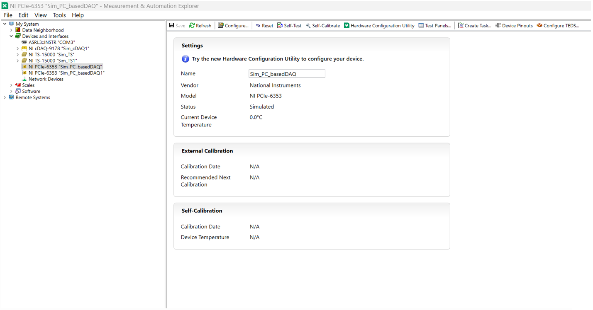
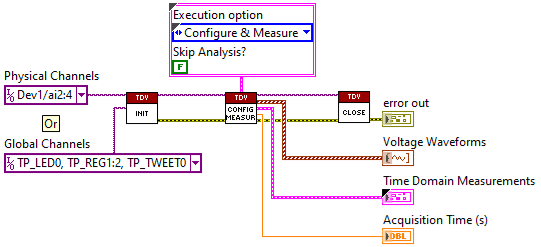

# PCB Assembly Test Toolkit for LabVIEW

<!-- labview-ci:dashboard -->
## LabVIEW CI

[](https://elijah286.github.io/nipcbatt-labview/)

LabVIEW CI runs on every pull request. See the [**CI dashboard**](https://elijah286.github.io/nipcbatt-labview/) for build status, VI Analyzer results, VI diffs, and mass-compile reports.

| Info | Description |
|------|-------------|
| **Info** | A LabVIEW based toolkit providing measurement libraries, validation examples and automation test sequences for electrical functional testing of PCB assembly. |
| **Author** | National Instruments |

## Table of Contents
- [About](#about)
- [Documentation](#documentation)
- [Prerequisites](#prerequisites)
- [Installation](#installation)
- [Getting Started](#getting-started)
- [Key Concepts](#key-concepts-in-labview-pcbatt-library)
- [Usage](#usage)
- [Bugs / Feature Requests](#bugs--feature-requests)
- [License](#license)

## About

The **PCB Assembly Test Toolkit for LabVIEW** includes measurement libraries, validation examples, 
and automation test sequences, for electrical functional testing of PCB assemblies. The measurement library 
along with the TestStand automation sequence can be used with data acquisition systems, DMM and 
switch instruments, CompactDAQ hardware or any device supported by NI-DAQmx.

## Documentation

Refer to the [PCB Assembly Test Toolkit for LabVIEW User Manual](https://www.ni.com/docs/en-US/bundle/pcb-assembly-test-toolkit-labview/page/system-components.html) for getting started steps including installation and setup procedures, and steps to launch toolkit in LabVIEW and run Automation Test Sequences.

## Prerequisites

PCB Assembly Test Toolkit for LabVIEW requires minimum versions of LabVIEW, TestStand, and NI driver 
application software.

### Required Software

- **LabVIEW:** 2021 SP1 or later (32-bit, 64-bit)
- **TestStand:** 2021 SP1 or later (32-bit, 64-bit)

### Required Drivers

- **NI-DAQmx:** 2022 Q4 or later
- **NI-DMM:** 2022 Q3 or later
- **NI-SWITCH:** 2022 Q4 or later
- **NI-Serial:** 21.3 or later
- **NI-VISA:** 21.5 or later
- **NI-845x:** 21.3 or later

To download the required software and drivers, visit [NI Package Manager](https://www.ni.com/en/support/downloads/software-products/download.package-manager.html#322516) or visit [ni.com/downloads](https://www.ni.com/en/support/downloads.html).

### Supported Hardware

The PCB Assembly Test Toolkit for LabVIEW supports all devices supported by the following driver 
application software: NI-845x, NI-DAQmx, NI-DMM, NI-Serial, and NI-SWITCH. 

The PCB Assembly Test Toolkit for LabVIEW provides specific support for the following NI hardware:

- PXIe, PCIe, and USB DAQ devices
- PXIe and USB DMM instruments
- PXI and PXIe switches
- CompactDAQ (cDAQ) chassis and modules, emphasizing support for temperature measurement
- TestScale chassis and modules
- NI USB-8452 (I2C/SPI) modules
- NI USB-232 or PXI-843x serial modules

## Installation

### Using the Source Code

To use the source code, clone the repository in the destination location and start using it 
directly by opening the LabVIEW project.

### Creating a Template in LabVIEW

Adding PCBA Toolkit as a project template in LabVIEW will help to instantiate PCBA project while creating a new LabVIEW project.
To add PCBA toolkit as a Template in LabVIEW, follow the below mentioned steps:

1. Download the source code from the repository.

2. Create a folder `PCB Assembly Test Toolkit` under the following location:

   **For 32-bit:**
   ```
   C:\Program Files (x86)\National Instruments\LabVIEW 20xx\ProjectTemplates\Source\
   ```

   **For 64-bit:**
   ```
   C:\Program Files\National Instruments\LabVIEW 20xx\ProjectTemplates\Source\
   ```

3. Copy `source/Library` and paste it in the mentioned location:

   **For 32-bit:**
   ```
   C:\Program Files (x86)\National Instruments\LabVIEW 20xx\ProjectTemplates\Source\PCB Assembly Test Toolkit\
   ```

   **For 64-bit:**
   ```
   C:\Program Files\National Instruments\LabVIEW 20xx\ProjectTemplates\Source\PCB Assembly Test Toolkit\
   ```

4. To create a template in LabVIEW, copy and paste the `source/NILV_PCBA_TemplateMetaData.xml` to:

   **For 32-bit:**
   ```
   C:\Program Files (x86)\National Instruments\LabVIEW 20xx\ProjectTemplates\MetaData\
   ```

   **For 64-bit:**
   ```
   C:\Program Files\National Instruments\LabVIEW 20xx\ProjectTemplates\MetaData\
   ```

5. Create a folder `PCB Assembly Test Toolkit for LabVIEW\TestStand` under:

   ```
   C:\Users\Public\Documents\National Instruments\
   ```

6. For **TestStand Automation Sequences**, copy `source/Automation`, `source/PCBA FT Demo`, 
`source/PCBA TestStand WorkSpace.tsw`, `source/PCBA TestStand WorkSpace.tso`, `source/PCBA TestStand Project.tpj`
and paste inside:

   ```
   C:\Users\Public\Documents\National Instruments\PCB Assembly Test Toolkit for LabVIEW\TestStand\
   ```

**Note:** To install previous versions of PCB Assembly Test Toolkit, visit [PCB Assembly Toolkit NI](https://www.ni.com/en/support/downloads/software-products/download.pcb-assembly-test-toolkit.html#565853).

## Getting Started

In order to use the nipcbatt-labview toolkit, you must have the required software and drivers installed. Both physical and simulated devices are supported. 

Finding and configuring device name in **NI MAX**:

<p align="center">
  
</p>

Finding and configuring device name in NI **Hardware Configuration Utility**:

<p align="center">
  
</p>

## Key Concepts in LabVIEW PCBATT Library

### 1. Libraries

All the measurement libraries consists of a simple three block architecture:
- Initialize
- Configure and measure (or) Configure and generate
- Close

<p align="center">
  
</p>

### 2. Features

#### Virtual Channels

Virtual channels, or sometimes referred to generically as channels, are software entities that encapsulate the physical channel along with other channel specific information (e.g.: range, terminal configuration, and custom scaling) that formats the data. A physical channel is a terminal or pin at which you can measure or generate an analog or digital signal. A single physical channel can include more than one terminal, as in the case of a differential analog input channel or a digital port of eight lines. Every physical channel on a device has a unique name (for instance, cDAQ1Mod4/ai0, Dev2/ao5, and Dev6/ctr3) that follows the NI-DAQmx physical channel naming convention. Refer to NI-DAQmx Channel for more information.

## Usage

### 1. Validation Examples

PC Based Examples and DMM Examples are created as examples for testing and validating a pair of libraries together. In PC based examples, one library is used for generation and another for measurement, it can be found in [PC Based examples](source/Library/PC%20Based%20Examples). DMM Examples are a combination of DMM and Switch libraries. In any DMM example, DMM measurement library is used for performing measurements and Switch library is used for switching to different test points, it can be found in [DMM Examples](source/Library/DMM%20Examples).

### 2. Automation Sequences

PCB Assembly Test Toolkit for LabVIEW provides test sequences built in TestStand using toolkit measurement libraries. These test sequences demonstrate basic electrical functional testing. Reuse or modify these test sequence to meet the requirements of your own application.

Following is the list of Automation Sequences provided in the library:

- Action Button Test Sequence
- Audio Test Sequence
- Communication Test Sequence
- Digital I/O Test Sequence
- LED Test Sequence
- Microphone Test Sequence
- Power Supply Test Sequence
- Sensor Test Sequence
- Synchronization Example Sequence

The Automation Sequences can be found in this location: [Automation](source/Automation).

### 3. PCB Assembly Functional Test Demo

The PCBA FT Demo test sequence demonstrates testing PCBA DUTs in TestStand using the PCB Assembly Test Toolkit measurement libraries built in LabVIEW. 

Please refer to the FT Demo Sequence in the location: [PCBA FT Demo](source/PCBA%20FT%20Demo).

## Bugs / Feature Requests

To report a bug or submit a feature request, please use [GitHub Issues](https://github.com/ni/PCBATT_LabVIEW/issues).

## License

**PCBATT LabVIEW** is licensed under an MIT-style license. Other incorporated projects may be 
licensed under different licenses. All licenses allow for non-commercial and commercial use.
